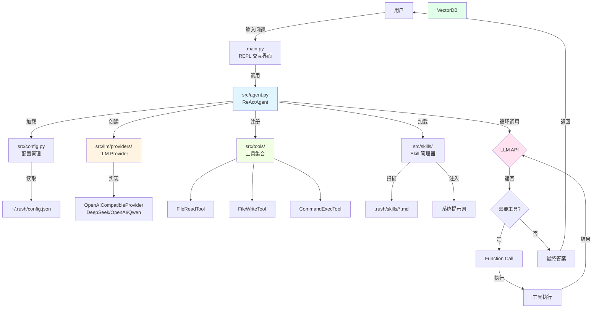
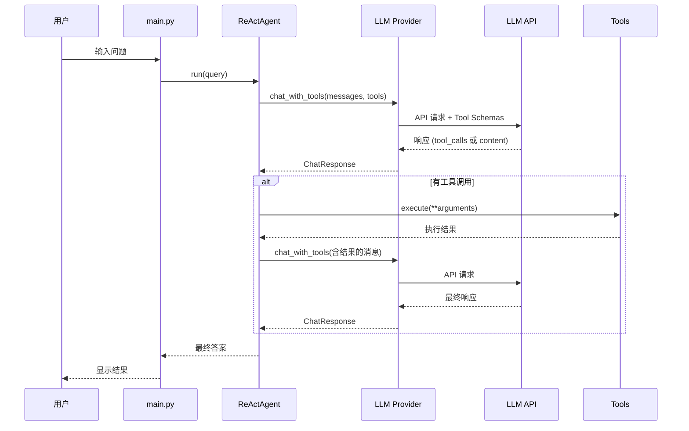

# Rush - ReAct Agent CLI

基于 ReAct(Reasoning + Acting)框架的命令行 AI Agent,使用 Function Calling 实现智能工具调用。

## 功能特性

- ✅ **Function Calling** - 使用结构化 API 进行工具调用,不占用上下文窗口
- ✅ **RAG 知识检索** - 基于向量数据库的知识检索与增强生成
- ✅ **Agent Skills** - 通过 Markdown 文件定义 Agent 行为准则和专业能力
- ✅ **MCP 集成** - 支持 Model Context Protocol,动态加载外部工具和服务
- ✅ **Provider 抽象层** - 支持多种 LLM 提供商(DeepSeek/OpenAI/Qwen),易于扩展
- ✅ **多向量数据库支持** - 支持 ChromaDB 和 Milvus,可配置切换
- ✅ **API 超时控制** - 可配置的请求超时,防止长时间卡住
- ✅ **实时进度显示** - LLM 调用时显示倒计时,清晰了解剩余时间
- ✅ **优雅中断处理** - Ctrl+C 立即中断并返回输入框,无需按两次
- ✅ **ReAct 框架** - Thought → Action → Observation 循环机制
- ✅ **模块化设计** - 配置、Agent、工具完全分离
- ✅ **REPL 交互界面** - 支持历史命令导航
- ✅ **自动配置管理** - 首次运行自动创建配置文件

## 项目结构

```
rush/
├── main.py                    # 主入口程序
├── requirements.txt           # Python 依赖
├── .gitignore                 # Git 忽略文件
├── .rush/                     # 项目配置目录
│   ├── config.json            # API 配置文件
│   ├── mcp_servers.json       # MCP Servers 配置
│   ├── README.md              # 配置说明文档
│   └── skills/                # 项目级 Agent Skills
│       ├── python-expert/
│       │   └── SKILL.md
│       └── cli-expert/
│           └── SKILL.md
└── src/                       # 源代码目录
    ├── __init__.py
    ├── config.py              # 配置管理模块
    ├── agent.py               # ReAct Agent 核心
    ├── skills/                # Skill 管理模块
    │   ├── __init__.py
    │   └── manager.py         # SkillManager 实现
    ├── mcp/                   # MCP 客户端模块
    │   ├── __init__.py
    │   ├── client.py          # MCP Client 实现
    │   └── manager.py         # MCP Manager 实现
    ├── llm/                   # LLM Provider 模块
    │   ├── __init__.py
    │   └── providers/
    │       ├── __init__.py
    │       ├── base.py        # Provider 抽象基类
    │       └── openai_compatible.py  # OpenAI 兼容实现
    ├── vector_db/             # 向量数据库模块
    │   ├── __init__.py
    │   └── providers/
    │       ├── __init__.py
    │       ├── base.py        # VectorDBProvider 抽象基类
    │       └── chromadb.py    # ChromaDB 实现
    └── tools/                 # 工具模块
        ├── __init__.py
        ├── base.py            # 工具基类
        ├── file_read.py       # 文件读取工具
        ├── file_write.py      # 文件写入工具
        ├── command_exec.py    # 命令执行工具
        ├── rag.py             # RAG 知识检索工具
        ├── skill_tool.py      # Skill 管理工具
        └── mcp_tool.py        # MCP 工具适配器
```

## 安装

1. 安装依赖:
```bash
pip install -r requirements.txt
```

2. 配置 API Key:
   - 支持**全局**和**本地**两种配置 (与 MCP 配置一致)
   - **全局配置**: `~/.rush/config.json` (所有项目共享)
   - **本地配置**: `.rush/config.json` (当前项目专属,优先使用)
   
   首次运行时会自动创建配置文件,编辑并填入你的 DeepSeek API Key:
```json
{
    "api_key": "your_deepseek_api_key_here",
    "base_url": "https://api.deepseek.com/v1",
    "model": "deepseek-chat",
    "vector_db": {
        "provider": "chromadb",
        "persist_directory": "~/.rush/chromadb"
    }
}
```

**使用场景:**
- **全局配置**: 常用的 API Key、通用设置
- **本地配置**: 项目特定的配置 (如不同的 API Key、模型等)

## RAG (检索增强生成) 使用说明

Rush 集成了基于 ChromaDB 的向量数据库,支持 RAG 功能:

### 工作原理

1. **知识存储** - 使用 `knowledge_add` 工具将知识保存到向量数据库
2. **语义搜索** - 使用 `knowledge_search` 工具进行相似度检索
3. **增强回答** - Agent 结合检索结果生成更准确的答案

### 使用示例

```python
# 1. 添加知识到知识库
knowledge_add('Python 是一种高级编程语言', source='维基百科')
knowledge_add('ChromaDB 是轻量级向量数据库', source='技术文档')

# 2. 从知识库中搜索
knowledge_search('Python 是什么?')
# 返回相关的知识片段

# 3. Agent 自动使用 RAG
# 当用户询问知识性问题时,Agent 会自动调用 knowledge_search
```

### 向量数据库特性

- ✅ **轻量级嵌入** - 无需安装 torch/sentence-transformers (节省 ~2GB)
- ✅ **本地持久化** - 数据保存在 `~/.rush/chromadb`,重启不丢失
- ✅ **可扩展架构** - 通过 Provider 抽象层支持切换其他向量数据库
- ✅ **语义搜索** - 基于词频哈希的向量相似度计算

## Agent Skills 使用说明

Agent Skills 是通过 Markdown 文件定义的 Agent 行为准则和专业能力,参考 Claude Code 的设计。

### 什么是 Agent Skills?

Skills 不是工具(Tools),而是:
- **行为准则**: 定义 Agent 在特定场景下应该如何行动
- **专业知识**: 注入特定领域的最佳实践和规范
- **角色定义**: 让 Agent 扮演特定专家角色

### Skills vs Tools 对比

| 特性 | Tools | Skills |
|------|-------|--------|
| **本质** | 执行具体操作 | 定义行为准则 |
| **形式** | Python 类 | Markdown 文件 |
| **作用** | 读文件、执行命令等 | 指导 Agent 如何思考和回答 |
| **示例** | file_read, command_exec | python-expert, cli-expert |
| **管理** | 代码中注册 | 文件系统 + manage_skills 工具 |

### 双层 Skill 结构

Rush 支持**全局**和**项目级**两种 skills:

```
全局 Skills: ~/.rush/skills/          # 所有项目共享
  └── general-assistant/
      └── SKILL.md

项目 Skills: .rush/skills/            # 当前项目专属
  ├── python-expert/
  │   └── SKILL.md
  └── cli-expert/
      └── SKILL.md
```

**加载顺序**:
1. 先加载全局 skills
2. 再加载项目 skills (同名会覆盖全局 skill)

### Skill 文件格式

每个 skill 是一个目录,包含一个 `SKILL.md` 文件:

```markdown
---
name: Python Expert
description: 专业的 Python 开发工程师,遵循 PEP 8 和最佳实践
---

# Python 开发最佳实践

## 代码风格
- 严格遵循 PEP 8 规范
- 使用 black 或 autopep8 格式化代码
- 变量和函数使用 snake_case

## 类型注解
- 所有函数参数和返回值都要添加类型注解
- 使用 typing 模块提供的高级类型
```

**关键点**:
- ✅ 使用 YAML frontmatter 定义 `name` 和 `description`
- ✅ 不需要额外的 skill.json 文件
- ✅ 符合 Claude Code 标准

### 使用示例

#### 1. 查看已加载的 skills

```
[Rush] > 列出可用的 skills

调用工具: manage_skills({'action': 'list'})

当前配置的 Agent Skills:

• General Assistant [全局]
  状态: ✓ 启用
  描述: 通用助手,提供友好、专业的帮助

• Python Expert [项目]
  状态: ✓ 启用
  描述: 专业的 Python 开发工程师,遵循 PEP 8 和最佳实践
```

#### 2. 添加新 skill

**项目级 skill** (仅当前项目):
```bash
mkdir -p .rush/skills/web-dev
cat > .rush/skills/web-dev/SKILL.md << 'EOF'
---
name: Web Developer
description: 专业的 Web 开发工程师
---

# Web 开发最佳实践
...
EOF
```

**全局 skill** (所有项目共享):
```bash
mkdir -p ~/.rush/skills/code-review
cat > ~/.rush/skills/code-review/SKILL.md << 'EOF'
---
name: Code Reviewer
description: 专业的代码审查专家
---

# 代码审查指南
...
EOF
```

然后刷新:
```
[Rush] > 刷新 skills

调用工具: manage_skills({'action': 'refresh'})
✓ Agent Skills 已刷新
总计: 4 个
新的 skills 将在下次对话时生效
```

**注意**: 
- Rush 是 CLI 工具,每次启动时会加载所有 skills
- 如果在会话中添加了新 skill 文件,需要手动刷新
- 刷新后会重建系统提示词,新 skills 在下次对话时生效

#### 3. 禁用某个 skill

```
[Rush] > 禁用 Python Expert skill

调用工具: manage_skills({'action': 'disable', 'skill_name': 'Python Expert'})
✓ 已禁用 skill 'Python Expert',下次对话时生效
```

### Skill 文件示例

**python-expert/SKILL.md**:
```markdown
---
name: Python Expert
description: 专业的 Python 开发工程师,遵循 PEP 8 和最佳实践
---

# Python 开发最佳实践

## 代码风格
- 使用 PEP 8 规范
- 变量和函数使用 snake_case
- 类名使用 PascalCase
- 添加类型注解
- 编写文档字符串

## 项目结构
- 使用模块化设计
- 分离关注点
- 遵循单一职责原则

## 测试
- 编写单元测试
- 使用 pytest 框架
- 保持高覆盖率
```

### Skills vs Tools 对比

| 特性 | Tools | Skills |
|------|-------|--------|
| **本质** | 执行具体操作 | 定义行为准则 |
| **形式** | Python 类 | Markdown 文件 |
| **作用** | 读文件、执行命令等 | 指导 Agent 如何思考和回答 |
| **示例** | file_read, command_exec | python-expert, cli-expert |
| **管理** | 代码中注册 | 文件系统 + manage_skills 工具 |

### 配置文件位置

- **全局 Skills**: `~/.rush/skills/` (所有项目共享)
- **项目 Skills**: `.rush/skills/` (当前项目专属)
- **优先级**: 项目 skill 覆盖同名全局 skill

## MCP (Model Context Protocol) 使用说明

MCP 允许 Agent 动态加载和使用外部工具和服务,如 GitHub、文件系统、数据库等。

### 什么是 MCP?

MCP (Model Context Protocol) 是一个开放协议,让 AI 应用可以:
- 🔌 **连接外部服务** - GitHub、数据库、文件系统等
- 🛠️ **使用远程工具** - 通过标准协议调用工具
- 🔄 **动态扩展** - 运行时添加/移除服务

### 配置 MCP Servers

MCP servers 配置文件与 config.json 保持一致,支持**全局**和**本地**两种配置:

**配置文件位置:**
- **全局配置**: `~/.rush/mcp_servers.json` (所有项目共享)
- **本地配置**: `.rush/mcp_servers.json` (当前项目专属)

**加载顺序:**
1. 先加载全局配置
2. 再加载本地配置 (同名 server 会覆盖全局配置)

**配置格式:**
```json
{
  "mcpServers": {
    "filesystem": {
      "command": "npx",
      "args": ["-y", "@modelcontextprotocol/server-filesystem", "/path/to/dir"],
      "enabled": true
    },
    "github": {
      "command": "npx",
      "args": ["-y", "@modelcontextprotocol/server-github"],
      "env": {
        "GITHUB_PERSONAL_ACCESS_TOKEN": "your_token_here"
      },
      "enabled": true
    }
  }
}
```

**使用场景:**
- **全局配置**: 常用的通用 services (如 GitHub、filesystem)
- **本地配置**: 项目特定的 services (如项目数据库、Git 仓库)

### 安装 MCP Server

```bash
# 文件系统 server
npm install -g @modelcontextprotocol/server-filesystem

# GitHub server
npm install -g @modelcontextprotocol/server-github

# 更多 servers: https://github.com/modelcontextprotocol/servers
```

### 使用示例

#### 1. Agent 启动时自动连接

Agent 启动时会自动连接所有启用的 MCP servers:

```
✓ 已加载 2 个 MCP servers (启用: 2)
✓ 已连接到 MCP server: filesystem-server
  发现 14 个工具: read_file, read_text_file, write_file, ...
✓ 已连接到 MCP server: github-mcp-server
  发现 26 个工具: search_repositories, create_issue, ...
✓ 已注册 40 个 MCP tools
```

#### 2. 搜索 GitHub 仓库

```
[Rush] > 搜索 langchain 相关的 GitHub 仓库

调用工具: mcp_github_search_repositories({'query': 'langchain', 'perPage': 3})

搜索结果:
1. langchain-ai/langchain - The agent engineering platform
   Stars: 110k+ | Created: 2022-10-17
   
2. langchain4j/langchain4j - Java version of LangChain
   Stars: 5k+ | Created: 2023-06-20
```

#### 3. 读取文件内容

```
[Rush] > 使用 mcp_filesystem_read_text_file 读取 README.md

调用工具: mcp_filesystem_read_text_file({'path': 'README.md'})
工具结果: # Rush - ReAct Agent CLI
基于 ReAct(Reasoning + Acting)框架的命令行 AI Agent...
```

### 可用的 MCP Servers

| Server | 工具数 | 功能 |
|--------|-------|------|
| **filesystem** | 14 | 文件读写、目录操作、搜索 |
| **github** | 26 | 仓库管理、Issues、PRs、搜索 |
| **git** | 10+ | Git 操作、提交历史、分支管理 |
| **postgres** | 5+ | PostgreSQL 数据库查询 |
| **sqlite** | 5+ | SQLite 数据库操作 |
| **memory** | 8+ | 知识图谱记忆存储 |

完整列表: https://github.com/modelcontextprotocol/servers

### MCP 工具命名规范

MCP 工具命名格式: `mcp_{server_name}_{tool_name}`

例如:
- `mcp_github_search_repositories` - GitHub 搜索仓库
- `mcp_filesystem_read_text_file` - 文件系统读取文件
- `mcp_postgres_query` - PostgreSQL 查询

### 管理命令

```python
# 列出 servers
manage_mcp('list')

# 连接/断开
manage_mcp('connect', 'github')
manage_mcp('disconnect', 'github')

# 启用/禁用
manage_mcp('enable', 'filesystem')
manage_mcp('disable', 'filesystem')

# 添加/移除
manage_mcp('add', 'git', 'npx', '-y @modelcontextprotocol/server-git')
manage_mcp('remove', 'git')
```

3. 安装依赖:
```bash
pip install -r requirements.txt
```

## 使用方法

运行程序:
```bash
python main.py
```

### 内置命令

- `/exit` - 退出程序
- `/clear` - 清除对话历史
- `/help` - 显示帮助信息

### 可用工具

1. **file_read** - 读取文件内容
   ```
   file_read('README.md')
   file_read('/path/to/file.txt')
   ```

2. **file_write** - 写入文件内容
   ```
   file_write('output.txt', 'Hello World')
   ```

3. **command_exec** - 执行系统命令(安全限制)
   ```
   command_exec('ls -la')
   command_exec('grep pattern file.txt')
   ```

4. **knowledge_search** - 从知识库中搜索相关信息(RAG)
   ```
   knowledge_search('Python 是什么?')
   ```

5. **knowledge_add** - 向知识库添加新知识
   ```
   knowledge_add('Rush 是一个 AI Agent 框架', source='项目文档')
   ```

6. **manage_skills** - 管理 Agent Skills
   ```
   # 列出所有 skills
   manage_skills('list')
   
   # 刷新 skills (重新扫描文件系统)
   # 适用场景: 在会话中添加了新 skill 文件后
   manage_skills('refresh')
   
   # 启用 skill
   manage_skills('enable', 'python_expert')
   
   # 禁用 skill
   manage_skills('disable', 'cli_expert')
   ```

7. **manage_mcp** - 管理 MCP Servers
   ```
   # 列出所有配置的 MCP servers
   manage_mcp('list')
   
   # 连接 MCP server
   manage_mcp('connect', 'github')
   
   # 断开 MCP server
   manage_mcp('disconnect', 'github')
   
   # 启用/禁用 server
   manage_mcp('enable', 'filesystem')
   manage_mcp('disable', 'filesystem')
   
   # 添加新 server
   manage_mcp('add', 'git', 'npx', '-y @modelcontextprotocol/server-git')
   
   # 移除 server
   manage_mcp('remove', 'git')
   ```

## 技术架构

### 系统架构图



### ReAct 工作流程图



### Function Calling vs Prompt-based

Rush 使用 **Function Calling** 模式,相比传统的提示词方式有显著优势:

| 特性 | Prompt-based | Function Calling (Rush) |
|------|-------------|------------------------|
| **上下文占用** | ❌ 工具描述占用 200-300 tokens | ✅ 仅占用 ~50 tokens |
| **解析可靠性** | ⚠️ 依赖正则,可能出错 | ✅ 结构化 JSON,100% 可靠 |
| **参数验证** | ❌ 需要手动验证 | ✅ API 层自动验证 |
| **扩展性** | ⚠️ 提示词会变很长 | ✅ 轻松支持数十个工具 |

### Provider 抽象层

Rush 设计了统一的 LLM Provider 接口,支持多种模型提供商:

```python
# 当前支持的 Provider
- OpenAICompatibleProvider: DeepSeek, OpenAI, Qwen(通义千问)

# 未来可扩展
- ClaudeProvider: Anthropic Claude
- GeminiProvider: Google Gemini
```

添加新 Provider 只需实现 `LLMProvider` 接口:

```python
from src.llm.providers.base import LLMProvider

class MyProvider(LLMProvider):
    def chat_with_tools(self, messages, tools):
        # 实现特定平台的工具调用逻辑
        ...
```

## 示例对话

### RAG 知识检索

```
[Rush] > Python 是什么?

============================================================
问题: Python 是什么?
============================================================

使用 Provider: OpenAI-Compatible (deepseek-chat)

[迭代 1/5]
调用工具: knowledge_search({'query': 'Python 编程语言'})
工具结果: [1] Python 是一种高级编程语言,由 Guido van Rossum 于 1991 年首次发布。
   来源: 维基百科

[2] Python 支持多种编程范式,包括面向对象、函数式和过程式编程。
   来源: 官方文档

[迭代 2/5]

============================================================
最终答案: Python 是一种高级编程语言,由 Guido van Rossum 于 1991 年首次发布。它支持多种编程范式...
============================================================
```

### Function Calling 模式

```
[Rush] > 读取 README.md 文件

============================================================
问题: 读取 README.md 文件
============================================================

使用 Provider: OpenAI-Compatible (deepseek-chat)

[迭代 1/5]
调用工具: file_read({'path': 'README.md'})
工具结果: 文件内容:
# Rush - ReAct Agent CLI
基于 ReAct(Reasoning + Acting)框架的命令行 AI Agent...

[迭代 2/5]

============================================================
最终答案: 我已经读取了 README.md 文件,这是一个基于 ReAct 框架的 AI Agent 项目...
============================================================
```

## ReAct 框架说明

ReAct(Reasoning + Acting)框架通过以下循环工作:

1. **用户提问** - 用户输入问题
2. **LLM 决策** - LLM 分析是否需要调用工具
3. **工具调用** - 如需工具,LLM 返回结构化调用请求
4. **执行工具** - Agent 执行工具并获取结果
5. **返回结果** - 将结果反馈给 LLM
6. **生成答案** - LLM 根据结果生成最终答案

这种设计让 AI Agent 能够:
- ✅ 进行逻辑推理和问题分解
- ✅ 调用外部工具获取实时信息
- ✅ 根据工具返回结果调整策略
- ✅ 解决复杂的多步问题

### 工作流程图

```
用户问题 → LLM 分析 → 需要工具? 
              ↓           ↓
            否           是
              ↓           ↓
         直接回答    调用工具 → 执行 → 返回结果
                                  ↓
                            继续分析...
```

## 如何添加新工具

1. 在 `src/tools/` 目录下创建新工具文件
2. 继承 `Tool` 基类并实现两个方法:
   - `execute()` - 工具执行逻辑
   - `get_schema()` - Function Calling schema 定义
3. 在 `src/agent.py` 的 `_register_tools()` 中注册

示例:

```python
from src.tools.base import Tool

class MyTool(Tool):
    def __init__(self):
        super().__init__(
            name="my_tool",
            description="我的工具描述"
        )
    
    def execute(self, param: str) -> str:
        return f"结果: {param}"
    
    def get_schema(self):
        return {
            "type": "function",
            "function": {
                "name": self.name,
                "description": self.description,
                "parameters": {
                    "type": "object",
                    "properties": {
                        "param": {"type": "string"}
                    },
                    "required": ["param"]
                }
            }
        }
```

## 配置文件位置

### 全局配置 (~/.rush/)
- **配置文件**: `~/.rush/config.json`
- **MCP Servers**: `~/.rush/mcp_servers.json`
- **向量数据库**: `~/.rush/chromadb` (自动创建)
- **历史命令**: `~/.rush/history.txt` (自动创建)
- **Agent Skills**: `~/.rush/skills/`

### 本地配置 (.rush/)
- **配置文件**: `.rush/config.json` (优先于全局配置)
- **MCP Servers**: `.rush/mcp_servers.json` (与全局合并)
- **配置说明**: `.rush/README.md`
- **Agent Skills**: `.rush/skills/`

**注意**: 
- 本地配置文件可以提交到 Git,方便团队共享和学习
- 请自行管理敏感信息(如 API Key)的安全性
- 向量数据库和历史记录不会被提交

## 技术栈

- **Python** 3.x
- **openai** >= 1.0.0 - OpenAI 兼容 API 客户端
- **prompt_toolkit** >= 3.0.0 - 命令行交互界面
- **chromadb** >= 0.4.0 - 向量数据库
- **DeepSeek API** - 大语言模型服务
- **Node.js/npm** - MCP servers 运行时 (可选)

### 支持的 LLM 提供商

- ✅ **DeepSeek** - deepseek-chat (默认)
- ✅ **OpenAI** - gpt-4, gpt-3.5-turbo
- ✅ **Qwen** - 通义千问 (兼容模式)
- 🔜 **Claude** - 待实现
- 🔜 **Gemini** - 待实现

## 许可证

MIT License
